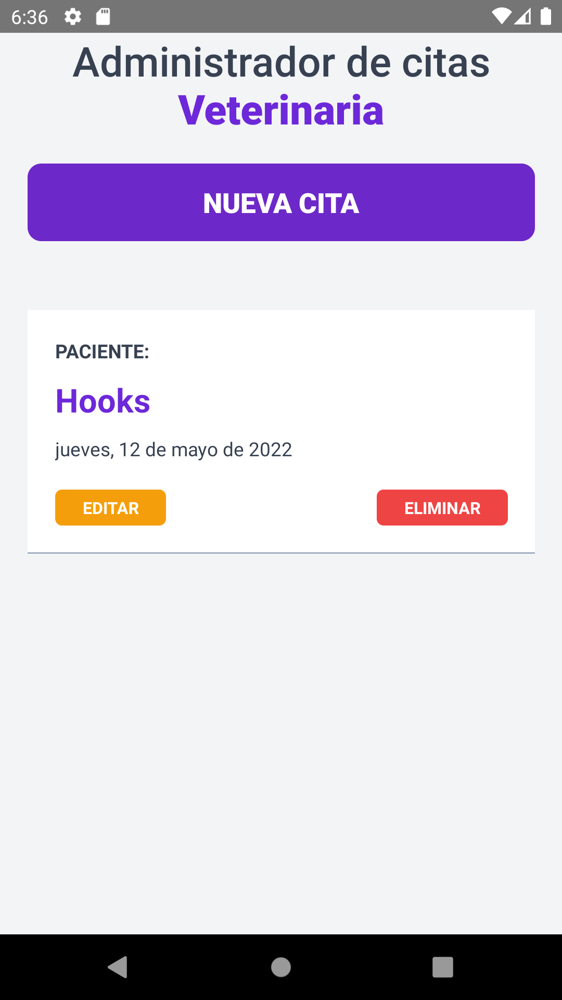
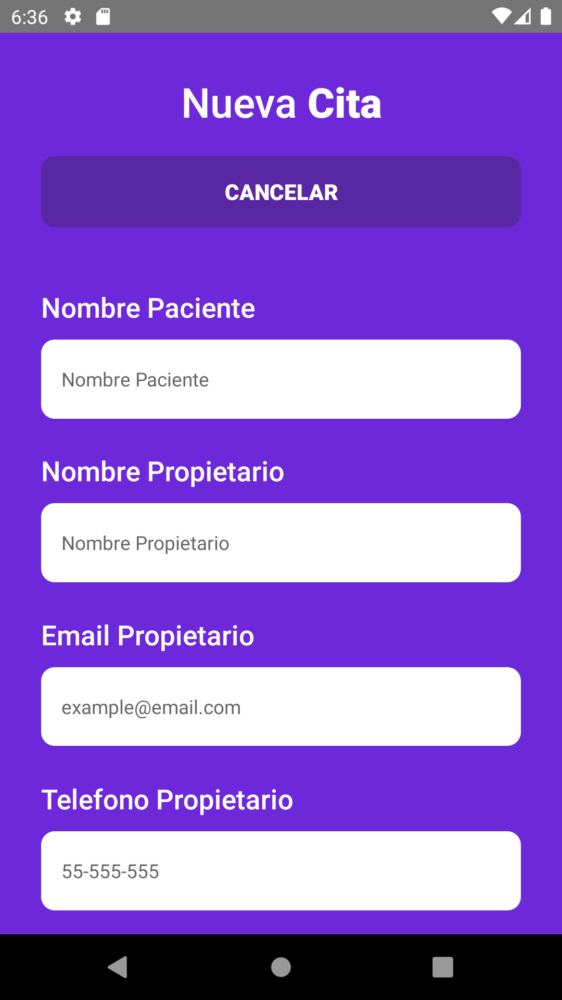
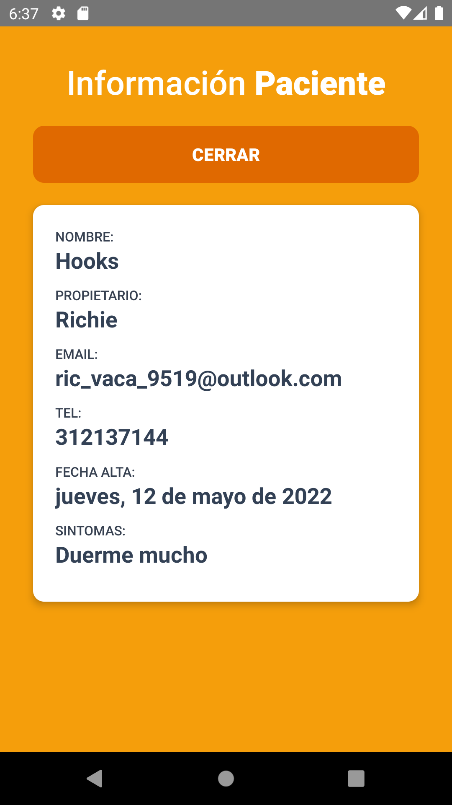

# CitasApp

Proyect from a course by Udemy, 
the functionality 
from this Proyect 
is set, update and delete Data for 
for the appointment management of a veterinarian


### React Native

This project was made in Javascript with the library
React and React-Native where it was implemented
- Hooks (useState, useEffect)
- Pressables
- Components
- Helpers
- Pickers for dates


## Deployment

To install dependencies:
```bash
    .\projectPath\ npm install
```

To deploy this project on Android run:

```bash
  npx react-native run-android
```
You need to have installed
- Android Studio
- NodeJs
- Java Development Kit
- Android SDK
- Add Android to PATH

#### Complements
- Flipper
- React Dev Tools

## Authors

- [@RichyVaca](https://github.com/RichyVaca)
- [@Juan Pablo De la torre Valdez From Udemy](https://www.udemy.com/course/react-native-crea-aplicaciones-para-android-y-ios-con-react/)

## Screenshots






